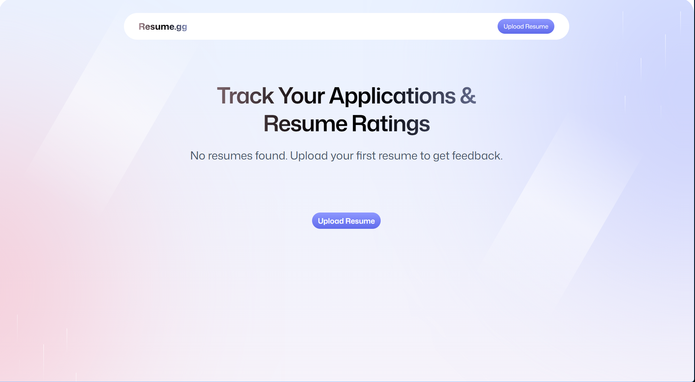
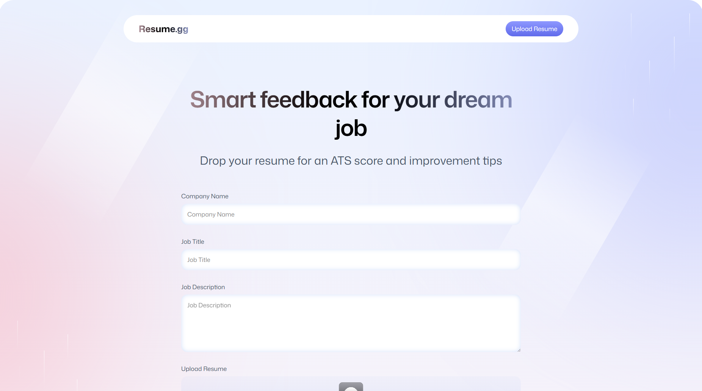

# 🎯 AI Resume Analyser

> **Smart feedback for your dream job** - Get AI-powered resume analysis with ATS scoring and personalized improvement tips.

[](https://reactjs.org/)
[](https://reactrouter.com/)
[](https://www.typescriptlang.org/)
[](https://tailwindcss.com/)
[](https://puter.com/)

## 📋 Table of Contents

- [Overview](#-overview)
- [Features](#-features)
- [Screenshots](#-screenshots)
- [Tech Stack](#-tech-stack)
- [Getting Started](#-getting-started)
- [Project Structure](#-project-structure)
- [How It Works](#-how-it-works)
- [Environment Setup](#-environment-setup)
- [Deployment](#-deployment)
- [Contributing](#-contributing)
- [License](#-license)

## 🌟 Overview

AI Resume Analyser is a modern web application that helps job seekers optimize their resumes using AI-powered analysis. Upload your resume, provide job details, and receive comprehensive feedback on ATS compatibility, content quality, structure, tone, and skills alignment.

The application leverages **Puter.js** for cloud storage, authentication, and AI capabilities, providing a seamless experience without the need for traditional backend infrastructure.

## ✨ Features

### 🤖 AI-Powered Analysis

- **Comprehensive Scoring**: Get detailed scores across 5 key categories:
  - 📊 **ATS Compatibility** - Ensure your resume passes Applicant Tracking Systems
  - 🎨 **Tone & Style** - Professional language and formatting assessment
  - 📝 **Content Quality** - Relevance and impact of your experience
  - 🏗️ **Structure** - Organization and readability evaluation
  - 💼 **Skills Alignment** - Match with job requirements

### 📤 Smart Upload System

- Drag-and-drop PDF resume upload
- Automatic PDF to image conversion for preview
- Job-specific analysis with company name, job title, and description

### 📈 Visual Feedback

- Interactive score gauges and progress indicators
- Color-coded improvement suggestions (good vs. needs improvement)
- Detailed explanations for each recommendation
- Side-by-side resume preview with feedback

### 🔐 Secure & Private

- User authentication via Puter.js
- Cloud-based storage for your resumes and analysis
- Personal dashboard to track all submissions

### 📱 Responsive Design

- Beautiful, modern UI with glassmorphism effects
- Fully responsive across desktop, tablet, and mobile devices
- Smooth animations and transitions

## 📸 Screenshots

> **Note**: Add your screenshots here

### Homepage




_Track all your resume submissions and their scores_

### Upload & Analysis


_Upload your resume and provide job details for tailored feedback_


## 🛠️ Tech Stack

### Frontend

- **[React 19](https://reactjs.org/)** - Modern UI library with latest features
- **[React Router 7](https://reactrouter.com/)** - Advanced routing and navigation
- **[TypeScript](https://www.typescriptlang.org/)** - Type-safe development
- **[TailwindCSS 4](https://tailwindcss.com/)** - Utility-first CSS framework
- **[Zustand](https://github.com/pmndrs/zustand)** - Lightweight state management

### Backend & Services

- **[Puter.js](https://puter.com/)** - Cloud platform providing:
  - 🔐 Authentication
  - 📁 File Storage (FS)
  - 🤖 AI Chat API (OpenAI o1 model)
  - 🗄️ Key-Value Store

### Tools & Libraries

- **[pdfjs-dist](https://mozilla.github.io/pdf.js/)** - PDF parsing and rendering
- **[react-dropzone](https://react-dropzone.js.org/)** - File upload component
- **[Vite](https://vitejs.dev/)** - Fast build tool and dev server

## 🚀 Getting Started

### Prerequisites

- **Node.js** 18+ and npm
- A **Puter.js** account (free at [puter.com](https://puter.com))

### Installation

1. **Clone the repository**

   ```bash
   git clone https://github.com/shrutikcs/ai-resume-analyser.git
   cd ai-resume-analyser
   ```

2. **Install dependencies**

   ```bash
   npm install
   ```

3. **Start the development server**

   ```bash
   npm run dev
   ```

4. **Open your browser**
   Navigate to `http://localhost:5173`

### Build for Production

```bash
npm run build
npm run start
```

## 📁 Project Structure

```
ai-resume-analyser/
├── app/
│   ├── components/          # React components
│   │   ├── ATS.tsx         # ATS score display
│   │   ├── Accordion.tsx   # Collapsible sections
│   │   ├── Details.tsx     # Detailed feedback sections
│   │   ├── FileUploader.tsx # Drag-drop upload
│   │   ├── Navbar.tsx      # Navigation bar
│   │   ├── ResumeCard.tsx  # Resume list item
│   │   ├── ScoreBadge.tsx  # Score indicators
│   │   ├── ScoreCircle.tsx # Circular progress
│   │   ├── ScoreGuage.tsx  # Score gauge visualization
│   │   └── Summary.tsx     # Feedback summary
│   ├── lib/                # Utility libraries
│   │   ├── puter.ts        # Puter.js integration & store
│   │   ├── pdf2img.ts      # PDF to image conversion
│   │   └── utils.ts        # Helper functions
│   ├── routes/             # Application routes
│   │   ├── auth.tsx        # Authentication page
│   │   ├── home.tsx        # Dashboard/homepage
│   │   ├── resume.tsx      # Resume detail view
│   │   └── upload.tsx      # Upload & analysis page
│   ├── app.css             # Global styles
│   ├── root.tsx            # Root component
│   └── routes.ts           # Route configuration
├── constants/
│   └── index.ts            # AI prompts & constants
├── types/
│   └── index.d.ts          # TypeScript type definitions
├── public/                 # Static assets
│   ├── images/             # UI images and backgrounds
│   └── icons/              # SVG icons
├── package.json
├── tsconfig.json
├── vite.config.ts
└── README.md
```

## 🔄 How It Works

### 1. **Authentication**

Users sign in via Puter.js authentication, which provides a secure cloud storage space for each user.

### 2. **Resume Upload**

- User uploads a PDF resume via drag-and-drop
- Resume is uploaded to Puter.js cloud storage
- PDF is converted to an image for preview using `pdfjs-dist`
- Image is also uploaded to cloud storage

### 3. **AI Analysis**

- User provides job details (company, title, description)
- Application sends resume + job context to Puter.js AI API (OpenAI o1 model)
- AI analyzes the resume across 5 dimensions:
  - ATS compatibility
  - Tone and style
  - Content quality
  - Structure
  - Skills alignment

### 4. **Feedback Storage**

- Analysis results are stored in Puter.js Key-Value store
- Each resume gets a unique UUID
- Data structure:
  ```typescript
  {
    id: string,
    resumePath: string,      // Cloud path to PDF
    imagePath: string,       // Cloud path to preview image
    companyName: string,
    jobTitle: string,
    jobDescription: string,
    feedback: Feedback       // AI analysis results
  }
  ```

### 5. **Dashboard & Review**

- Users can view all their submitted resumes
- Click on any resume to see detailed feedback
- Side-by-side view of resume and AI suggestions

## 🔧 Environment Setup

### Puter.js Configuration

This application uses Puter.js SDK, which is loaded via CDN in the HTML. No API keys are required for basic usage, but you need to:

1. **Sign up** at [puter.com](https://puter.com)
2. **Sign in** when prompted in the application
3. Your cloud storage and AI quota are managed by Puter.js

### Custom Configuration (Optional)

If you want to modify the AI model or prompts:

1. Edit `constants/index.ts` to customize the AI instructions
2. Modify the model in `app/lib/puter.ts` (line 354):
   ```typescript
   {
     model: "o1";
   } // Change to other supported models
   ```

## 🐳 Deployment

### Docker Deployment

A `Dockerfile` is included for containerized deployment:

```bash
docker build -t ai-resume-analyser .
docker run -p 3000:3000 ai-resume-analyser
```

### Static Hosting

Since this is a React Router application, you can deploy to:

- **Vercel**
- **Netlify**
- **Cloudflare Pages**
- **GitHub Pages**

Build the app first:

```bash
npm run build
```

Then deploy the `build/` directory to your hosting provider.

## 🤝 Contributing

Contributions are welcome! Here's how you can help:

1. **Fork** the repository
2. **Create** a feature branch (`git checkout -b feature/AmazingFeature`)
3. **Commit** your changes (`git commit -m 'Add some AmazingFeature'`)
4. **Push** to the branch (`git push origin feature/AmazingFeature`)
5. **Open** a Pull Request

### Development Guidelines

- Follow TypeScript best practices
- Maintain consistent code formatting
- Add comments for complex logic
- Test across different browsers
- Ensure responsive design

## 📝 License

This project is licensed under the **MIT License** - see the [LICENSE](LICENSE) file for details.

## 🙏 Acknowledgments

- **[Puter.js](https://puter.com/)** - For providing the cloud infrastructure and AI capabilities
- **[React Router](https://reactrouter.com/)** - For the excellent routing framework
- **[TailwindCSS](https://tailwindcss.com/)** - For the utility-first CSS framework
- **[PDF.js](https://mozilla.github.io/pdf.js/)** - For PDF rendering capabilities

## 📧 Contact

Have questions or suggestions? Feel free to:

- Open an issue
- Submit a pull request
- Reach out on social media

---

<div align="center">

**Made with ❤️ for job seekers everywhere**

[⬆ Back to Top](#-ai-resume-analyser)

</div>
